# FellowHub


 [](https://opensource.org/licenses/MIT)


<p align="center">
    <a href="https://fellowhub.tech">
        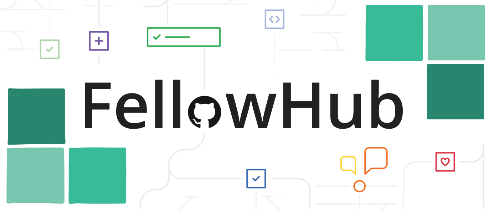
    </a>
</p>

<p align="center">
    July 17th, 2020 - <a href='https://fellowship.mlh.io/'>MLH Fellowship</a> Halfway Hackathon Project<br>
    by <a href='https://github.com/shu8'>Shubham Jain</a>, <a href='https://github.com/kendevops'>Kenneth Aladi</a> and <a href='https://github.com/ivov'>Iván Ovejero</a>.
</p>

## What the what!?

**FellowHub is the love child of the MLH Fellowship and GitHub—an all-encompassing platform with a profusion of features to fire up fellow engagement 😅 and make fellows' lives easier 😀 and _to get every fellow a job!_ 😮**

—Tagline: MLH-ify your life!

<p align="center">
    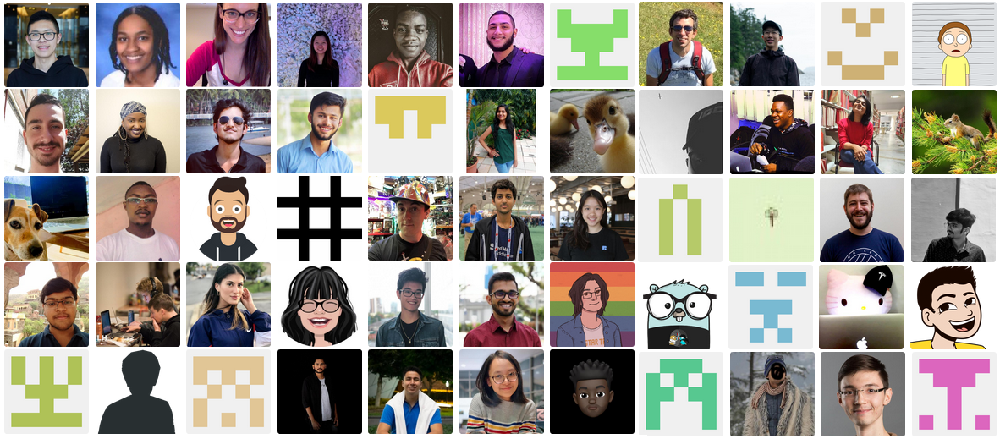
</p>

## Please explain!?

**Question**: What kind of relentless, ruthless and even reckless project can we come up with in order to compete at _every_ category in the 2020 MLH Fellowship Halfway Hackathon? :joy:

**Answer**: A monster webapp _slash_ employment service _slash_ notification system _slash_ exchange market _slash_ general election, where we put in **everything we have** to help fellows **in every way we can**. :fire:

1. You need **stats and summaries** of just about everyone and everything in the Fellowship?
2. You'd like to put together **a finger-lickin' portfolio** for your upcoming job hunt?
3. You're dead stuck with a bug and need **help with some tech**, but unsure who to turn to?
4. You'd like to have more **GitHub stars** in your repos and **endorsements on LinkedIn**?
5. You're rummaging through **job boards** for roles geared to junior devs with your skills?
6. You're loving this slick **new GitHub UI** and want to see more of these Octicons everywhere?
7. You've had it with **Google Calendar** and when was it again that we have that session today?
8. You want a **general election** to find out who's the fairest, most beloved fellow of them all?
9. You need a helping hand **writing cover letters**, e-mails to recruiters, pitches and the like?
10. You're curious about **meaningless trivia** like who's the fellow who's committing the most every week?
11. You're looking to partner up with a fellow to help rehearse for your imminent **job interview**?
12. You loved the **Learn in Public Workshop** more than anything in the universe has ever loved anything else, and now you dream about getting your hands on the full **[Coding Career Creator Package](https://www.learninpublic.org/#buy)** worth \$250?

This time, **FellowHub** is where it's at! :heart:

## Are you serious!?

**Yes!** Let's take it from the top! :muscle:

### 🌐 Homepage

You need data, lots of it, **all of it!** That's why in the homepage, our webapp [fellowhub.tech](https://www.fellowhub.tech) greets you with **every fellow, pod, project, mentor and MLH staffer**, in true GitHub-like tabbed view style. Did we mention it's all searchable?

And this is just the welcome screen!

<p align="center">
    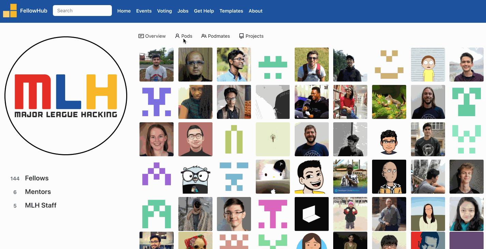
</p>

### 📑 Professional Portfolio

Click through to a fellow and stand in awe (and envy!) of **each fellow's professional profile**. Drill down into every fellow's **PRs, issues and standups** during the Fellowship period.

<p align="center">
    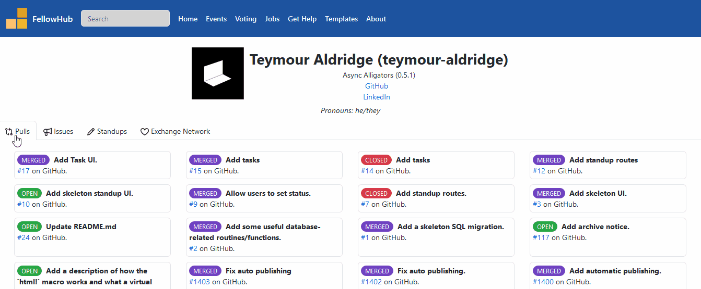
</p>

We also hooked up this data to the `#fellowhub` channel on the Fellowship Discord server, so every Friday at a fixed time, fellowbot will announce who's what we like to call **the MVF**, the most valuable fellow, the one who pushed the most commits during the week!

Pointless? Definitely! But at least this time the points actually mean something!

<p align="center">
    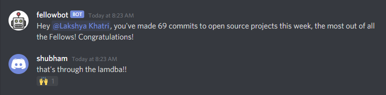
</p>

### ⭐ Exchange of GitHub Stars + LinkedIn Endorsements

But you're worldly, you're savvy, anyone can do scraping. You're like: "Show me the money!"

So on top of this, we built an **exchange market for GitHub stars and LinkedIn recommendations**.

Simply go to a fellow's portfolio, click on the `Exchange Network` tab, select `GitHub` and star one of their repos from inside our app. Our trusty fellowbot will notify them on the `#fellowhub` channel in Discord, inviting them to return the favor!

<p align="center">
    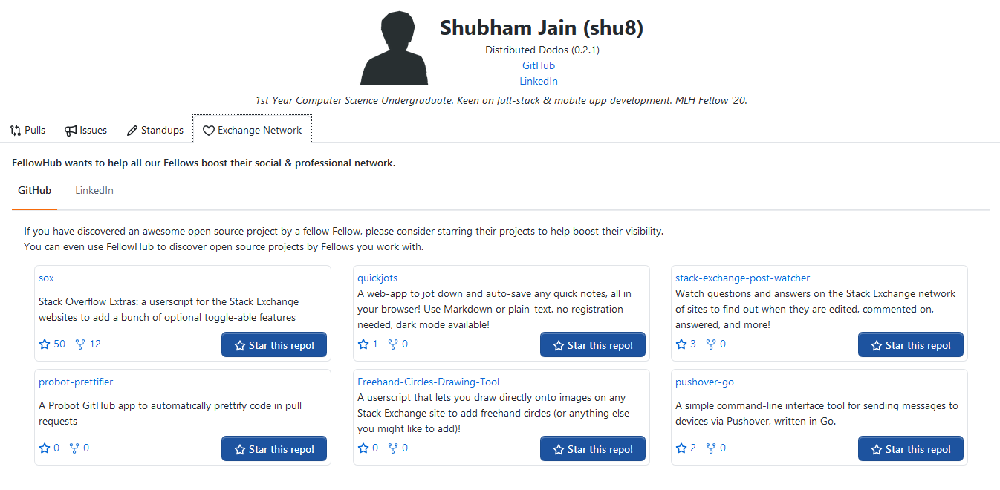
    <br>
    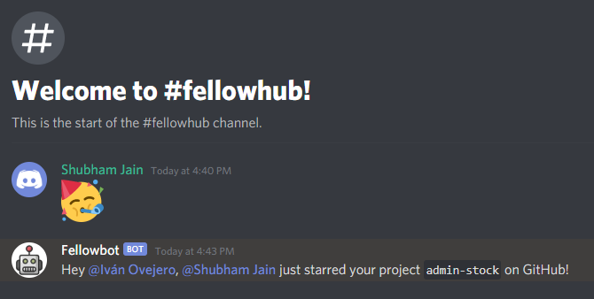
</p>

Or maybe you're more into **LinkedIn endorsements**?

Then select the `LinkedIn` section, take one of our pre-made recommendation templates, click on the first button to visit their LinkedIn profile, do the deed, come back and click on `I've endorsed [fellow]!` so Fellowbot will notify them and invite them to reciprocate!

<p align="center">
    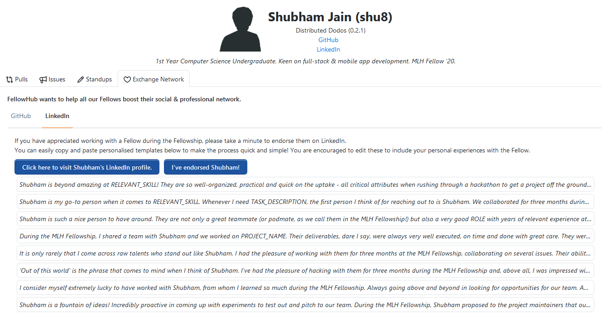
</p>

### 💼 Giant Job list

But internet points can only get you so far!

What about jobs? **Fellows need jobs.** Remote jobs, given the times!

So what then? You can just click on the aptly named `Jobs` link on the FellowHub header and boom, a mountain of **hand-picked, high-quality, A+ remote job boards** of all shapes, colors and sizes! Painstakingly collected, and all yours for the taking!

<p align="center">
    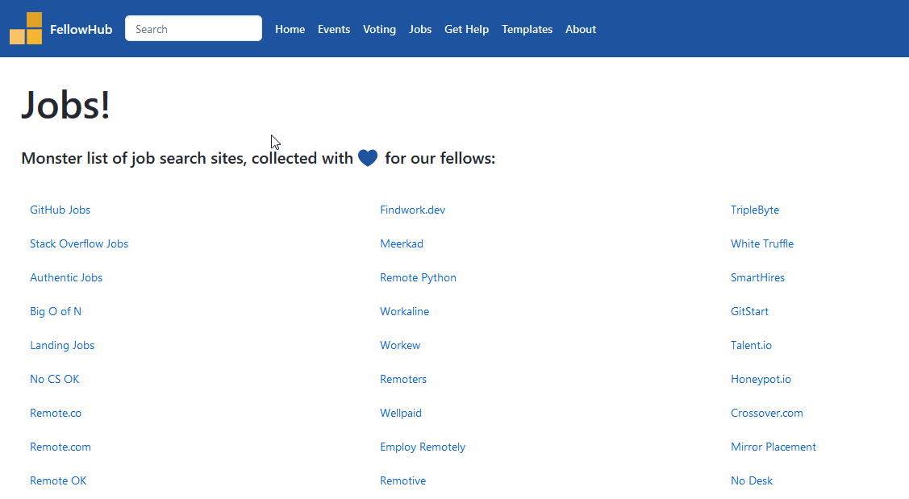
</p>

### 📔 Templates

Okay, access to jobs is nice, what if you're a **terrible communicator**? Recruiters keep talking circles around you and throw you for a loop when speaking? What's all this business-speak anyway?

We "synergize backwards overflow in revenue sources" so you don't have to! We've prepared an assortment of templates with your data already filled in, so you can just fire off that e-mail and get back to doing what you love!

<p align="center">
    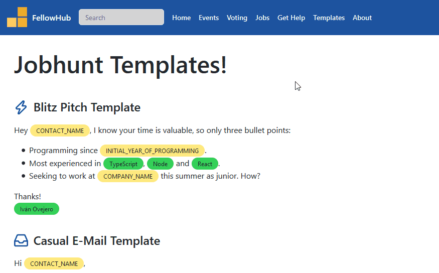
</p>

### 💬 Mockme

Say you found the job, you sent the template, the recruiter was intrigued and, before you know it, **you now have a call scheduled**! You're now supposed to _talk_, and be _likable_, and show _personality_!

We understand you, we _are_ you, and so we rejiggled the fellowbot to answer to `!mockme` to get you **mock interviews**. Whenever you have a job interview coming up, you can invite one of the 160 fellows to pitch in and help you out!

Get some practice in, meet a new fellow, and clinch the job!

<p align="center">
    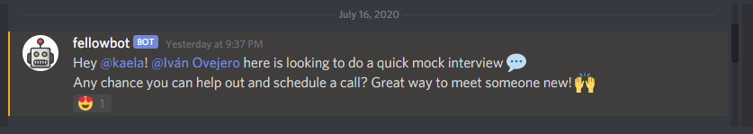
</p>

### 💯 GitHub Primer Design

By the way, noticed anything familiar about the webapp UI? We're using GitHub's lovingly crafted and recently released **[Primer Design System](https://primer.style/components/)**, which we like the look of but had zero experience in! Menus, buttons, search bars, labels and as many **Octicons** as our taste allowed us to stuff in!

<p align="center">
    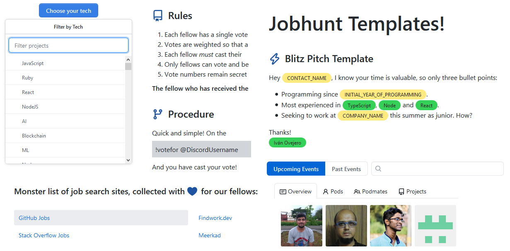
</p>

### ❓ Getting Help

Thinking of the GitHub UI may have made you think of **that one issue you still need to fix** when this Hackathon thing is over.

So what then? What if you're stuck on an issue and you're way **too shy to ask the world for help**? We're here for you, because we've been there ourselves!

Just click on `Get Help` link on the FellowHub header and filter the MLH Fellowship down to **the most approachable-looking fellow who knows that technology you're stuck with**.

<p align="center">
    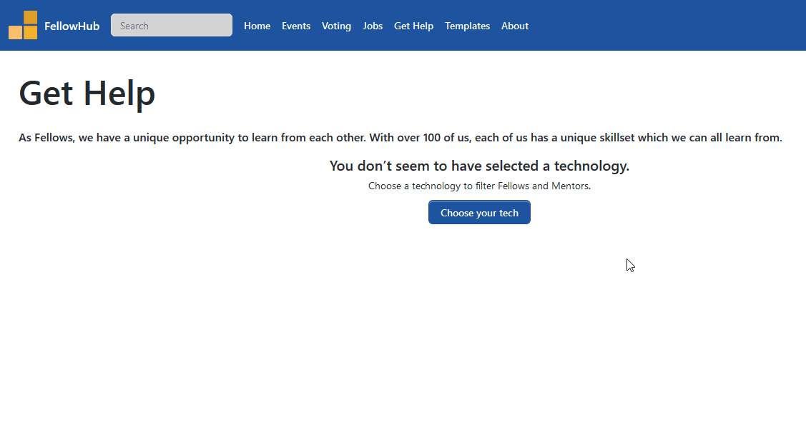
</p>

### 📆 Scheduled Events

But what if it's _scheduling_ what you need help with? How many times have you gone back to **recheck the schedule for a session**? What's the Zoom link again? Oh I thought that was tomorrow? What do you mean it was yesterday?

**Filter everything, find the event, get the link.**

We basically just wanted it for ourselves, but it's much too useful not to throw it in!

<p align="center">
    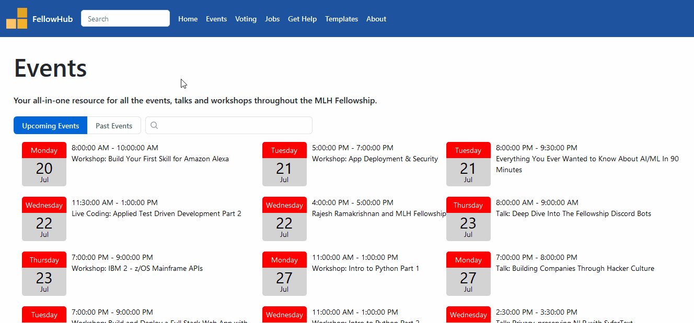
</p>

### 🗳️ Voting Contest

Okay, granted, it's a lot! Can I stop reading now?

_Or is there a grand finale?_

To finish off our project with a bombastic bang and a boom, we decided to set up an **[All-Fellow Voting Contest](https://www.fellowhub.tech/voting-contest)**, a general election with proper rules, an easy voting procedure, and of course, **a mind-blowing, jaw-dropping, eye-popping prize for the winner!**

More details in the link above! For the prize, keep on scrolling!

<p align="center">
    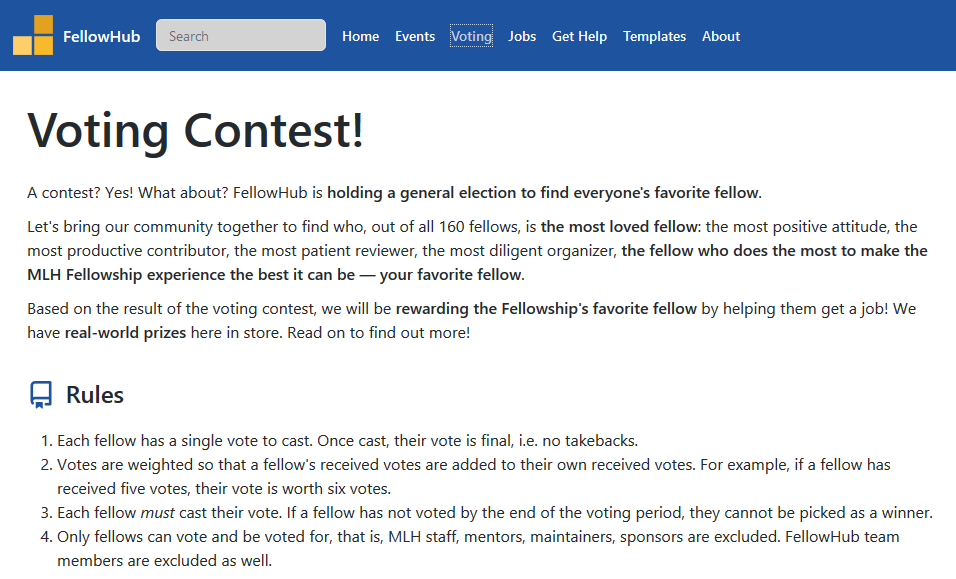
    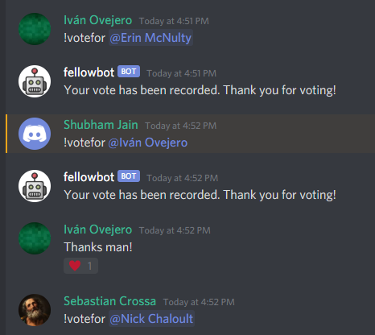
</p>

### 🧠 Learn in Public!

We lobbied, hustled and bustled so that the FellowHub Voting Contest Winner will be awarded the **[Coding Career Creator Package from LearnInPublic.org](https://www.learninpublic.org/#buy)** worth \$250! You cannot _afford_ to save that much money.

You know you want it! And we're just thrilled to deliver!

<p align="center">
    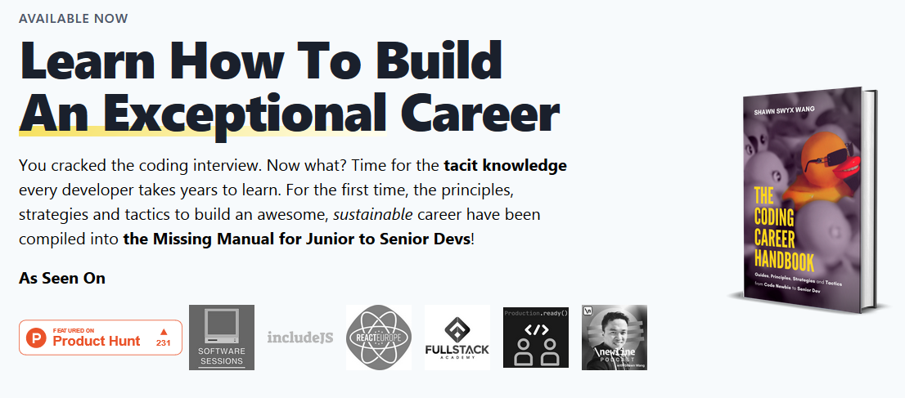
    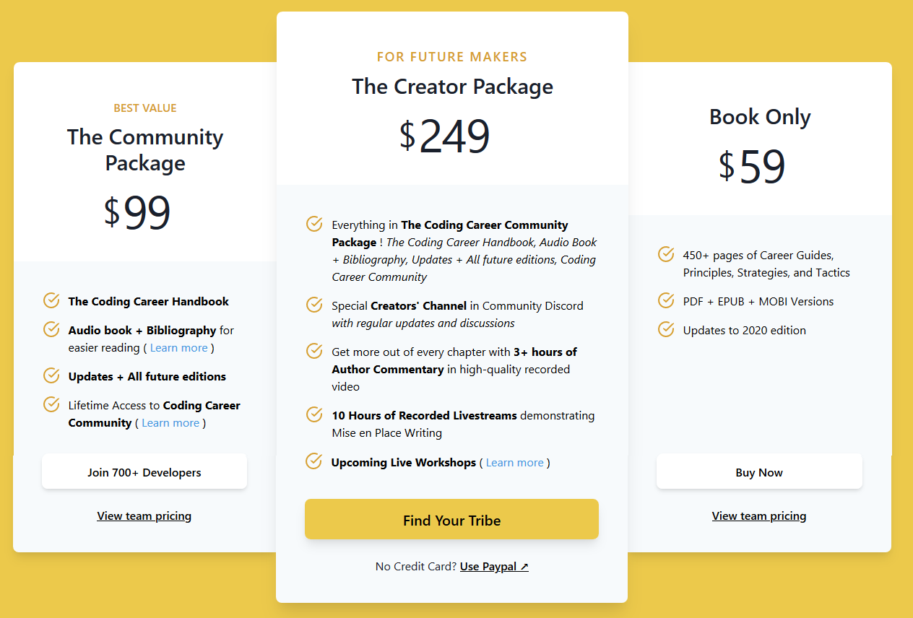
</p>

## How does this all work!?

Oh we thought you'd never ask! We're happy to have used lots of open-source technologies to create this ~~Franken~~ FellowHub!

**Lots of tech to get your hands dirty with!**

### [AWS Backend](./aws-backend)

Most of these files are auto-generated by the [`amplify` CLI tool](https://github.com/aws-amplify/amplify-cli).

```bash
cd aws-backend
npm install -g @aws-amplify/cli
amplify configure
amplify init # to create your own project
amplify deploy
```

You'll generally only be interested in the `src/` directories in the `aws-backend/amplify/backend/function` subdirectories. To summarise the functions (matching the directory names), and the differences from the old project, [Fellowbook](https://github.com/MLH-Fellowship/0.2.1-fellowbook):

#### New endpoints

- `calendarendpoint` — function for the `/events` API endpoint, to fetch data from the MLH Fellowship Google Calendar.
- `discordwebhookendpoint` — function for the `/discord-message` API endpoint, to send messages to the MLH Fellowship Discord server using a Webhook URL generated for the `#fellowhub` channel.
- `mostvaluablefellow` — function that is triggered using the AWS scheduler every week, which queries the GitHub API for every fellow, to get the one with the most commits, and send a shoutout for them to the Discord Server every Friday

#### Updated endpoints

- `fellowendpoint` — function for the `/fellows/:username` API endpoint.

  **What's changed?** We now use the GitHub GraphQL API to dynamically fetch pull requests, issues, and top/pinned repos for a user before returning it, so it's always up to date!

- `standupendpoint` — function for the `/standups` API endpoint to get recent standups.

  **What's changed?** We now return many more standups when requesting for a specific user (this is consumed in the web-app Portfolio)

#### Unchanged endpoints

- `fellowsendpoint` — function for the `/fellows` API endpoint, to return all the Fellows from our DynamoDB instance
- `githubauthtoken` — function for the `/authorize` API endpoint to authorize a user for the web app and get an access token
- `githuborgauth` — function for the AWS API Gateway Authorizer, to ensure a given access token belongs to a member of the MLH-Fellowship GitHub organization
- `randomendpoint` — function for the `/random` API endpoint to get a randomised list of fellows for a pod/random fellow

### [Webapp](./web)

This is just a [React](https://reactjs.org/) app that uses the [GitHub Primer](http://primer.style/) design system.

```bash
cd web
npm install
npm run start # → the web-app will run on localhost:3000 and auto-reload
```

#### Deploying the webapp

We use [Netlify](https://netlify.com) to deploy the web app. You can use the provided [`netlify.toml`](./web/netlify.toml) file, or set it up in the UI. Note: **the base directory must be `web`** otherwise it won't work!

### [Discord Bot](./discord-bot)

```bash
cd discord-bot
npm install
node index.js # Run locally
```

Make sure you have a `.env` file in `discord-bot` with `BOT_TOKEN={DISCORD_BOT_TOKEN}` and `GITHUB_LOGIN_TOKEN={GITHUB_ACCESS_TOKEN}`.

The Discord bot is hosted on a Heroku dyno — to deploy, see [Heroku's Node.js documentation](https://devcenter.heroku.com/articles/getting-started-with-nodejs). Make sure you set the environment variables in Heroku's interface!

### [Voting server](./voting-server)

You'll need [PostgreSQL](https://www.postgresql.org/) installed.

```bash
cd voting-server
npm install
node server.js
```

To deploy, use standard Heroku deployment techniques, and add the [PostgreSQL Add On](https://www.heroku.com/postgres). To push your local database to the remote:

```bash
PGUSER=postgres PGPASSWORD=password heroku pg:push fellow_voting DATABASE_URL —app fellow-voting-system
```

## Hackathon Disclaimer

Our lawyers require us to disclose the following:

- This project is a **fork** of the original [Fellowbook project](https://github.com/MLH-Fellowship/0.2.1-fellowbook/). There is a clear [**separation of commits**](https://github.com/MLH-Fellowship/0.2.1-fellowbook/compare/master...shu8:master). All commits on this fork have been done _solely_ in this Hackathon.
- All of the functionality being presented here is the product of our blood, sweat and tears during the Halfway Hackathon **this week**.
- The webapp frontend from the first Hackathon was **entirely scrapped**. The bot commands added during the first Hackathon and subsequent weeks were **unmodified**. The Amplify backend was **modified as explained** in the previous section.

If you have any questions about this, please let us know! Thanks!

## Any closing remarks?

If you're anything like us, and we are, then nothing ever seems like too much! And this being our last chance to pitch before [the Michael Jordan of Hackathon Organization](https://github.com/theycallmeswift), we simply just had to do it all!

1. **Community Building:** Learn all about your fellows, vote for them, star their projects and endorse their skills!
2. **Learning New Skills:** Win the contest and get the prize pack that will single-handedly make you a senior dev!
3. **Getting Help:** Find that specific fellow who knows what you don't, watch as your profiles rack up GitHub stars and LinkedIn endorsements, do mock interviews with a fellow!
4. **Remote Work / Tooling:** Get our giant remote job board list, get our premade business-speak templates to deal with recruiters, get mock interview practice!
5. **Showcase / Portfolio:** Access your own portfolio with more than you ever wanted to know about yourself!
6. **Navigating the Fellowship:** Find and filter and click through to the Fellowship events with our Events feature!

As thoroughly as we could!

- **Thematically relevant:** Each and every one of our features are there to improve the MLH Fellowship experience.
- **Technically impressive**: 3 backends, 2 DBs (SQL and NoSQL), countless REST and GraphQL API integrations, webhooks, Heroku, AWS, React, Node, Netlify, we lost count!
- **Beautifully designed**: Lovely UI adopting GitHub's brand-new and recently released Primer Design System!
- **Fully completed**: No stone left unturned, no PR left unmerged, no task left undone. It was mentally, physically, and everythingly exhausting, but we feel whole!
- **Learning**: Many painful lessons this week on topics including, but not limited to, database structuring, DNS, webhooks, merge conflicts, and so much more.
- **OSS best practices**: +190 commits, +60 issues, +25 PRs, labels, discussions, code reviews, you name it!

---

We had ideas, a big purpose, and a full week to build, but even if at first FellowHub did seem **way too much**, in the end we decided **to go all out by going all in**! And we're so glad we did!

As an ancient Greek goddess once said:

> "Just do it!"
